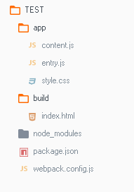
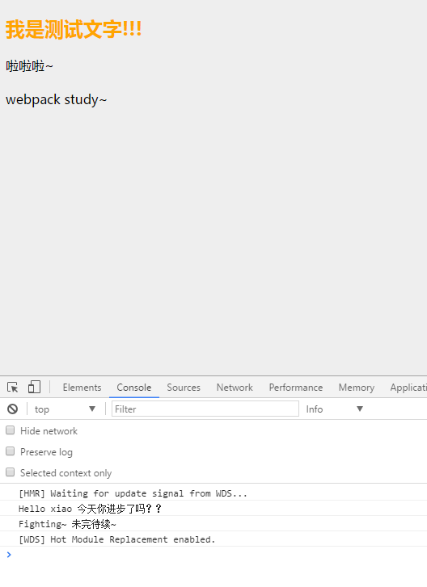

### 初探webpack的魅力
#### 1.什么是webpack？
webpack是目前最流行的模块打包工具，它的作用是把相互依赖的模块处理成静态资源。它可以将`js`、`jsx`、`coffee`、`less`、`sass`和图片等作为模块来处理和使用(被模块化的不仅仅是js了)；它还可以使用`Loader`（加载器）把`images`转换成url形式的数据。不同的文件对应着不同的加载器，使用加载器我们可以直接在js文件中`require`来加载各种文件，比如：
```
 require('reset.css');
 require('index.js');
 require('img.png');
```
#### 2.webpack的特点
- 一切皆为模块；
- 兼容多模块风格；
- 静态解析、按需加载。
#### 3.安装webpack
首先要先安装'node.js'同时包管理器npm也会随node.js一起安装
```
$ npm install webpack -g
```
将依赖写入package.json包
```
npm init
npm inatall webpack --save-dev
```
注：
- `npm init` 相关的问题可以根据自己的要求填写，之后还可以进行修改，所以不用担心填错的问题。这里会初始化一个package.json文件，该文件用来配置当前包。
- `--save-dev`该命令会把webpack安装到本地（当前文件夹下），并在开发依赖字段devDependencise中保存信息，打开package.json文件可以查看到该字段。
#### 4.简单的使用实例
##### *构建目录

- app里存放的是我们自己编写的文件；
- build里存放了我新建的索引页index.html，同时打包后的bundle.js文件也会存到该文件夹下。

首先我们来看下配置文件webpack.config.js里的配置：
```
var webpack = require("webpack");
var path = require("path");
module.exports = {
    //页面入口文件配置
    entry: [
    // __dirname是当前运行的js所在的目录
        path.join(__dirname, "app/entry.js")
    ],
    //入口文件输出配置 
    output: {
        path: path.join(__dirname, "build"),     //打包后文件存放的位置 必须为绝对路径
        publicPath:"assets",   //指定编译后的包(bundle)的访问位置
        filename: "bundle.js"    //打包后输出文件的文件名
    }
}
```
- path.resolve和path.join
  
  join方法仅仅进行路径拼接
  resolve方法则会做一些解析工作，它会将参数从右至左拼起来，直到遇到一个绝对路径。[path的node官网文档](https://nodejs.org/dist/latest-v7.x/docs/api/path.html#path_path_resolve_paths)
- output.path与output.publicPath

  output.path值为输出目录的绝对路径，也可用[hash];
  output.publicPath项则被许多Webpack的插件用于在生产模式下更新内嵌到css、html文件里的url值，**必须通过这个属性来告诉热加载模块去哪加载**

  详情请看[path与publicPath](http://www.jianshu.com/p/dcb28b582318)

##### *配置webpack-dev-server服务器
webpack-dev-server可以让浏览器**实时刷新**,显示我们对文件的改动。
>webpack-dev-server是一个小型的node.js Express服务器，默认监听8080端口，为webpack打包生成的资源文件提供Web服务。webpack-dev-server发送关于编译状态的消息到客户端，客户端根据消息作出相应。

###### 安装webpack-dev-server
```
npm install webpack-dev-server --save-dev
```
###### 配置package.json文件script字段

cmd指令：
```
webpack-dev-server --devtool eval-source-map --progress --colors --inline --hot --content-base build
```

手动写入package.json:
```
"scripts": {
    "test": "echo \"Error: no test specified\" && exit 1",
    "build": "webpack -w",
    "dev": "webpack-dev-server --devtool eval-source-map --progress --colors --inline --hot --content-base build"
  }
```

注：手动写入package.json文件的话，就不用每次都在终端输入那么长的指令了，只需要输入`npm run dev`就可以启动`webpack-dev-server`服务器了。
- `--devtool eval-source-map` 配置该sourcemap(源码地图)用于调试bundle，浏览器通过看这个地图，将打包的模块的调试工作，重新放到原始的模块中。有了它，出错的时候出错工具将直接显示原始代码，而不是转换后的代码；
- `--progress --colors` 前者表示显示打包过程，后者是给显示出来的进度加点颜色；
- `--content-base` 设置目录；
- `--inline`自动刷新的一种模式，还有一种是iframe模式：

  >在iframe模式下：页面是嵌套在一个iframe下的，在代码发生改动的时候，这个iframe会重新加载

  >在inline模式下：一个小型的webpack-dev-server客户端会作为入口文件打包，这个客户端会在后端代码改变的时候刷新页面

- `--hot`热替换，就是 **局部刷新**，可以提高开发效率，节约时间。前边我们使用inline方式，每次都会刷新整个页面，而iframe模式会刷新整个iframe标签，显然不是我们想要的高效；
- 如果你不想使用默认端口，可以通过`--port 8090`来设置端口号。

###### 好了现在看下我写的简单的例子吧

在index.html里引入`bundle.js`文件

```
<html>
    <head>
        <meta charset="utf-8">
    </head>
    <body>
        <script type="text/javascript" src="assets/bundle.js" charset="utf-8"></script>
    </body>
</html>
```

在`entry.js`中写入：

```
document.wirte("It works!");
```

然后在命令行执行`npm run dev` ：

```
npm run dev
```

然后在浏览器里输入：`localhost:8080` 会看到 It works!

然后，我们更改entry.js文件：`document.wirte("It works123!");`我们可以看到此时浏览器自动刷新了页面，即显示It works123!

接下来添加一个模块`content.js`,并修改入口`entry.js`:

在`content.js`中写入：

```
module.exports = "It works from content.js!";
```

在`entry.js`中修改：

```
document.write(require("./content.js"));       //添加模块
```

此时我们可以看到页面上已经显示：It works from module.js!

##### *接下来我们新建一个样式文件`style.css`,并写入：

```
body{
    background: #eee;
}
body,html{
    font-family: '微软雅黑', arial;
}
h2{ color: orange;}
```

###### 然后配置加载器`Loader`：

`webpack.config.js`:

```
module: {
    //加载器配置  告知webpack每一种文件都需要什么加载器来处理
        loaders: [
            // {test: require.resolve('jquery'), loader: "expose?jQuery!expose?$"},
            // {test: /bootstrap\/js\//, loader: "imports?jQuery=jquery"},
            {test: /\.jade$/, loader: "jade-loader"},
            //css文件使用 style-loader和css-loader来处理
            {test: /\.css$/, loader: "style-loader!css-loader"},
            {test: /\.json$/, loader: "json-loader"},
            {test: /\.(png|jpeg|gif|jpg)$/, loader: "url-loader?limit=25000"},

            {test: /\.woff(\?v=\d+\.\d+\.\d+)?$/, loader: "url?limit=10000&mimetype=application/font-woff"},
            {test: /\.woff2(\?v=\d+\.\d+\.\d+)?$/, loader: "url?limit=10000&mimetype=application/font-woff2"},
            {test: /\.ttf(\?v=\d+\.\d+\.\d+)?$/, loader: "url?limit=10000&mimetype=application/octet-stream"},
            {test: /\.eot(\?v=\d+\.\d+\.\d+)?$/, loader: "file"},
            {test: /\.svg(\?v=\d+\.\d+\.\d+)?$/, loader: "url?limit=10000&mimetype=image/svg+xml"}
        ]
    }
```

注：这里边还配置了一些相应的文件处理，如`jade`、`json`、`各种图片格式`以及一些`音频文件` 等。

###### entry.js:

```
require("./style.css");
```

此时观察浏览器，可以看到我们写的样式已经生效。

#### 5.引入JQuery 
首先要保证本地已经安装了jQuery，如果没安装，我们使用下边的命令进行安装：

cmd指令：

```
npm install jquery --save-dev
```

然后我们在entry.js文件里引入jquery：

```
window.$ = require("jquery");
```

为了测试我们对`index.html`文件进行以下修改：

```
<!DOCTYPE html>
<html lang="en">
    <head>
        <meta charset="utf-8">
    </head>
    <body>
        <div id="app">
            <h2></h2>
            <p></p>
            <h4></h4>
        </div>
    </body>
    <script type="text/javascript" src="assets/bundle.js" charset="utf-8"></script>

</html>
```

并对`content.js`也做一些修改：

```
var oDiv = document.getElementById('app');
oDiv.children[0].innerHTML = "我是测试文字!!!"
// console.log(oDiv.children[0]);

exports.sayHello = function (name) {
    console.log('Hello ' + name + '今天你进步了吗？？');
};
exports.sayBye = function (name) {
    console.log('Fighting~ ' + name);
}
```

还有`entry.js`:

```
require("./style.css");
var cont = require("./content.js");
window.$ = require("jquery");

document.write("webpack study~");
cont.sayHello('xiao '); 
cont.sayBye('未完待续~');

$("#app").children('p').html("啦啦啦~");
```

此时观察浏览器显示情况，如图：



说明我们已经可以使用jQuery了~